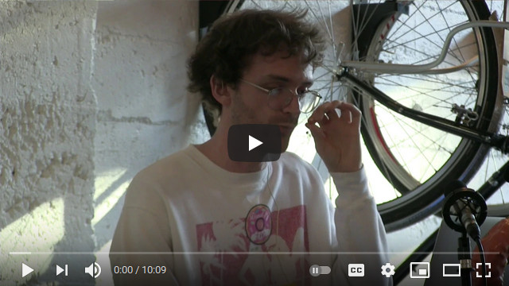
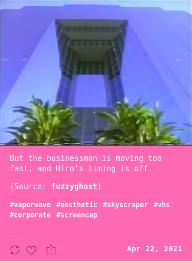

# Modempunk #

Modempunk is a bot for creating an automated art blog using the [Tumblr Node client](https://github.com/tumblr/tumblr.js/) and the [Tumblr API](https://www.tumblr.com/docs/en/api/v2). (C) 2014 - Present. 

Created to explore the interesting results found when vaporwave art is randomly paired with sentences from William Gibson novels. This was my first major exploration into generative content. 

Tumblr user posts matching various tags, such as ```glitch art``` and ```vaporwave```, are queried from the API and paired with random sentences from a corpus of 1980s cyberpunk novels, using a custom sentence parsing function.

See [modempunk.com](https://modempunk.com) for a live demo. I also did the HTML/CSS design.

[](https://youtu.be/lGno3ElyXCc)

## Premise ##



The image above was grabbed by the bot via the ```/posts``` API method because it was tagged with the keywords ```vaporwave``` and ```vhs```. The random sentence paired with it, an excerpt from _Snow Crash_ by Neal Stephenson, provides a brief impression of a detailed world.

## Anatomy of a post ##

The bot uses the Tumblr API to query posts that:
* Match a tag (or tags) provided as a command line argument by the user
* Have occurred within a timeframe less than X amount of seconds specified as a command line argument by the user.

## Usage ##

The following command will query all Tumblr posts made within the last 1800 seconds that are associated with the tag ```vaporwave```:
```
node main.js 'vaporwave' 1800
```

The bot will query each post and publish them to the blog whose credentials are specified in the user-provided ```config.js``` file, appending a random sentence from the file ```neuromancer.js```, which on my local copy contains the full text of _Burning Chrome_ and _Neuromancer_ by William Gibson, and _Snow Crash_ by Neal Stephenson as a string parameter. Configure as desired.

## Configuration ##

You'll need to set up a server. Digital Ocean has [pretty good guides](https://www.digitalocean.com/community/tutorials/initial-server-setup-with-ubuntu-20-04) on how to do this. You'll also need to [install Node](https://www.digitalocean.com/community/tutorials/how-to-install-node-js-on-ubuntu-20-04).

Tumblr created a [wrapper client](https://github.com/tumblr/tumblr.js/) you can use instead of XHR or Fetch to make the API requests. This is what the bot uses. First, install it in your environment:
```
npm install --save tumblr.js
```
After that, you can download the Modempunk repository with the following command:
```
git clone https://github.com/zacfinger/modempunk
```

Your ```config.js``` file contains the Tumblr-provided credentials for your Tumblr blog. It must be formed like this:

```javascript
module.exports = { 
  consumer_key: // your consumer key as string
  consumer_secret: // your consumer secret as string
  token: // your token as string,
  token_secret: // your token secret as string
}
```
See [Tumblr's API documentation](https://www.tumblr.com/docs/en/api/v2) for the appropriate values. You'll need to [register your application](https://www.tumblr.com/oauth/apps) with Tumblr to get your API keys.

Your file ```neuromancer.js``` can contain any multisentence string, but must be arranged as follows:

```javascript
module.exports = "That summer Parker had trouble sleeping. There were power droughts; sudden failures of the delta-inducer brought painfully abrupt returns to consciousness...
```
The ```users.js``` simply ```module.exports``` an array of users that have asked me not to reblog their stuff. The bot will ignore their posts.